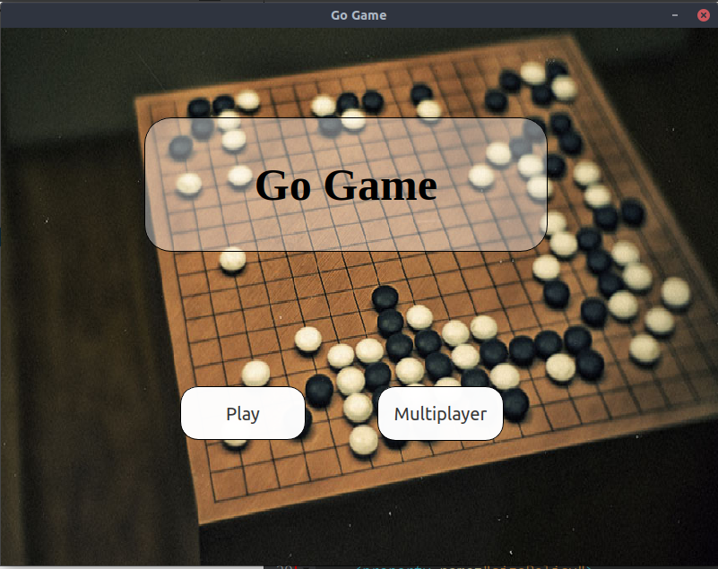
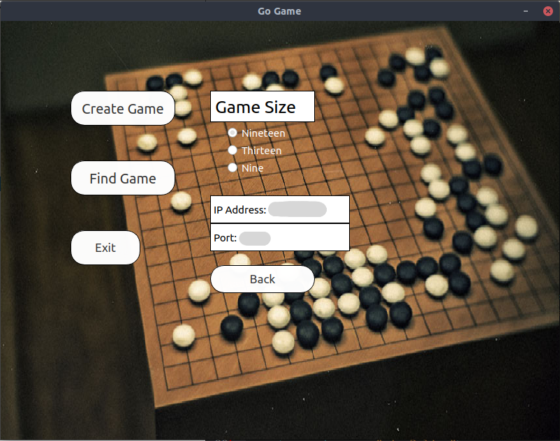
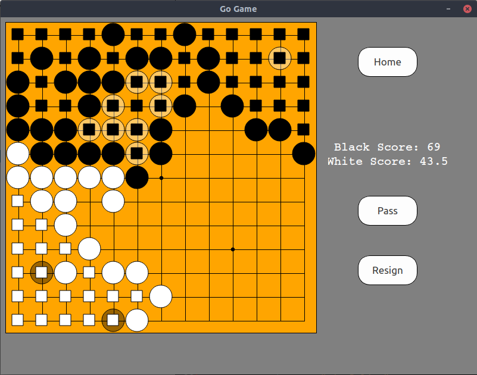

# Game of Go

Game of Go implimented in Qt and C++.

## Checklist

- [x] Basic Go Functionality
- [x] TCP Multiplayer
- [ ] Basic AI using Deep RL

## Preview

### Menu Page

### Multiplayer Page

### Game Page

